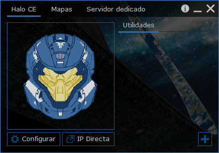
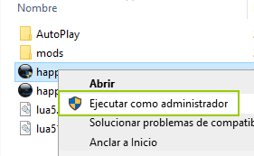
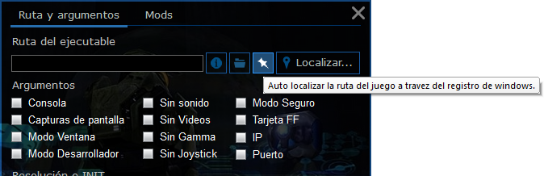

# HAPP (Halo CE APP)

Es un útil mini launcher para el Halo Custom Edition.

## Características
- Te permite descargar e instalar con un solo click varios 'mods', tales como: HAC2, chimera, ENB Series, etc.
- Puedes configurar los comandos de lanzamiento como: el 'modo ventana' (window) el 'cport', el 'ip', etc.
- Te permite administrar las configuraciones de tu init.txt
- Tiene un acceso directo para conectarse directamente a un servidor, con la opción de 'Ip Directa'
y como algo extra, te da un pequeño espacio adicional en su interfaz para adicionar los programas (utilidades) que normalmente usas para jugar el HALO CE

## Instalación

El launcher es 'portable', así que basta con descargar el archivo **'happ.zip'** que se encuentra en este mismo repositorio y extraer sus archivos en donde uno quiera, para luego abrir el archivo **"happ.exe"**, preferentemente 'como administrador', para que no tenga problemas al crear los archivos de configuración o descargando / instalando los mods.

> OJO: La primera vez que lo ejecutes, tendrás que configurar la ruta de tu 'Halo CE', si no la conoces basta con 'auto localizarla' haciendo click en el ícono de 'autolocalizar', osea este:

### Enlaces de interés
- **Halo CE (Instalador oficial)**: [http://hce.halomaps.org/index.cfm?fid=3947](http://hce.halomaps.org/index.cfm?fid=3947)
- **Update 1.0.10**: [http://hce.halomaps.org/index.cfm?fid=6798](http://hce.halomaps.org/index.cfm?fid=6798)
- Instalador no oficial (incluyendo el update): [http://www.haloce.net](http://www.haloce.net)

### Cosas Por hacer
- Adicionar 'Open Sauce 4' como opción de descarga para 'mod'
- Adicionar configuración de preferencias del HAC2 en la misma interfaz del launcher, así como también la administración de las medallas y sonidos.
- Sugerir instalación de utilidades.